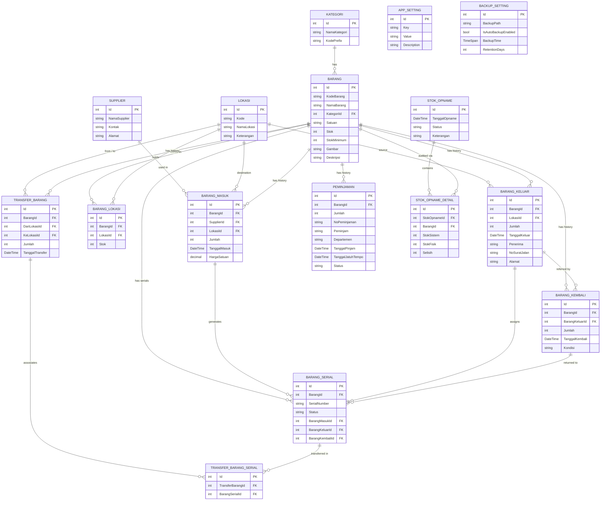

# 📦 MyGudang

**MyGudang** adalah Sistem Informasi Manajemen Inventaris & Gudang berbasis web yang dirancang khusus untuk mencatat, melacak, dan mengelola seluruh aktivitas pergudangan secara digital dan terpusat. Aplikasi ini dikembangkan untuk memastikan akurasi data stok barang, meminimalisir kehilangan, serta mempermudah pembuatan laporan dan dokumen resmi.

Aplikasi ini dikembangkan oleh **IT Region Jatimbalinus - PT Pertamina Patra Niaga**.

---

## 🌟 Fitur Utama (Features)

1. **Dashboard Informatif**
   Menampilkan ringkasan statistik (total barang, stok rendah/habis, mutasi bulan ini) beserta grafik interaktif pergerakan barang masuk/keluar.

2. **Manajemen Master Data Lengkap**
   - **Kategori & Supplier**: Mengelompokkan jenis barang dan mencatat daftar pemasok (vendor).
   - **Lokasi & Ruangan**: Mengelola letak fisik/ruangan tempat barang disimpan.
   - **Data Barang**: Pencatatan spesifikasi, satuan, dan penentuan batas "Stok Minimum" untuk peringatan _restock_.
   
3. **Pencatatan Serial Number (S/N)**
   Mendukung pelacakan barang bergaransi tinggi/aset menggunakan fitur *Serial Number* yang melekat pada setiap transaksi masuk, keluar, maupun transfer.

4. **Siklus Inventaris Terintegrasi**
   - **Barang Masuk**: Penambahan stok dari Supplier (Mencetak Surat Jalan & BAST).
   - **Barang Keluar**: Distribusi/pengeluaran barang kepada PIC tertentu (Mencetak Surat Jalan & BAST Bulk).
   - **Peminjaman & Pengembalian**: Melacak pergerakan inventaris yang sifatnya dipinjam (non-habis pakai) berserta notifikasi tanggal jatuh tempo.
   - **Transfer Ruangan**: Memindahkan stok dari satu lokasi/ruangan ke ruangan lain tanpa mengubah total keseluruhan stok.

5. **Stok Opname (Audit Fisik)**
   Modul pencatatan pencocokan stok fisik di lapangan dengan stok yang ada di sistem (menghitung selisih/penyesuaian stok).

6. **Laporan & Export Excel Terotomatisasi**
   Fasilitas export seluruh transaksi masuk, keluar, stok, peminjaman, dan transfer barang dengan sekali klik (format menyesuaikan master data).

7. **Fitur Pendukung Ekstra**
   - **Auto-Backup Database**: Pencadangan database terjadwal di latar belakang (_Background Service_).
   - **Setting Dokumen**: Manipulasi Kop Surat, Konter Penomoran Otomatis, dan Personalisasi Kop langsung dari UI.
   - **Log Aktivitas**: Merekam jejak audit/aktivitas log (Siapa melakukan Apa dan Kapan).
   - **Arsip**: Tempat penyimpanan soft-file atau dokumen PDF eksternal.

---

## 🔄 Alur Kerja Aplikasi (Workflow)

Aplikasi memiliki alur pergudangan (*supply-chain*) standar yang mudah diikuti:

1. **Setup Awal** 
   SuperAdmin memasukkan Master Lokasi, Kategori, dan tabel Supplier terlebih dahulu.
2. **Katalogisasi Barang** 
   Menambahkan Data Barang baru, menentukan _Stok Minimum_ dan mendaftarkan kode awal.
3. **Penerimaan (Inbound)** 
   User masuk ke modul Barang Masuk &rarr; Memilih Barang + Ruangan penyimpan &rarr; Memilih Supplier &rarr; Menentukan Jumlah & Serial Number (opsional). Otomatis menambah stok.
4. **Distribusi / Mutasi (Outbound / Move)** 
   - *Keluar Tetap*: Masuk ke modul Barang Keluar (Stok berkurang permanen).
   - *Keluar Sementara*: Masuk ke modul Peminjaman (Stok sistem masih menganggap aset tersebut *harus kembali*).
   - *Perpindahan Fisik*: Modul Transfer Barang dari Ruang A ke Ruang B.
5. **Pengembalian Barang**
   Peminjam atau penerima barang (dari Barang Keluar sebelumnya) dapat mem-balikkan barang melalui modul Pengembalian (Stok bertambah kembali).
6. **Validasi (Audit)** 
   Setiap pertengahan atau akhir tahun, Supervisor melakukan Stok Opname mencatat apakah fisik = sistem.

---

## 🛠️ Teknologi yang Digunakan (Tech Stack)

Aplikasi ini menggunakan teknologi yang sangat reliabel dari ekosistem .NET:

| Kategori | Teknologi/Library | Kegunaan |
|----------|-------------------|----------|
| **Backend Framework** | ASP.NET Core MVC (v8.0) | Arsitektur utama aplikasi, logika server, & kontroler. |
| **ORM & Database** | Entity Framework Core (v8.0) Microsoft SQL Server | Manajemen manipulasi data (Code-First Migration). |
| **Autentikasi** | ASP.NET Core Identity | Sistem *Role-Based Access Control* (SuperAdmin & Admin). |
| **Frontend UI** | AdminLTE v3.2 Bootstrap 4 | Kerangka *Dashboard* antarmuka, responsif & bersih. |
| **Tabel Interaktif** | DataTables.js (v1.13) | Tabel data yang mendukung *Search*, *Pagination*, dan *Sort*. |
| **UI Components** | Select2, SweetAlert2 | Pemilihan *dropdown* yang bisa dicari & Notifikasi Pop-Up Modern. |
| **Reporting / Export**| ClosedXML & EPPlus | Menghasilkan file Excel rekap laporan kustom secara *on-the-fly*. |

---

## 📊 Entity Relationship Diagram (ERD)

Diagram di bawah ini menunjukkan struktur relasi database dari MyGudang:

---

## 🔒 Hak Akses Role (Access Level)

Aplikasi memiliki dua level peran user (Role) untuk manajemen akses:

1. **SuperAdmin** (`admin@mygudang.com`): Mempunyai hak akses **penuh (Full Control)** atas semua modul termasuk Manajemen User, Log Aktivitas, Edit Data Barang, Penghapusan Master, Modul Setelan *(Kop Surat, System Settings, Backup Settings, dll)*.
2. **Admin**: Dikhususkan untuk staf gudang sehari-hari yang dapat mengakses dashboard, seluruh mutasi entri harian (Barang Masuk, Keluar, Peminjaman, Transfer), mengunduh laporan, Master Lokasi/Kategori/Supplier, tanpa izin untuk menghapus data sensitif atau masuk ke konfigurasi sistem.

---

> _Dokumentasi ini dibuat & dikelola agar pengembang maupun pengguna dapat memahami gambaran utuh dari aplikasi MyGudang._
