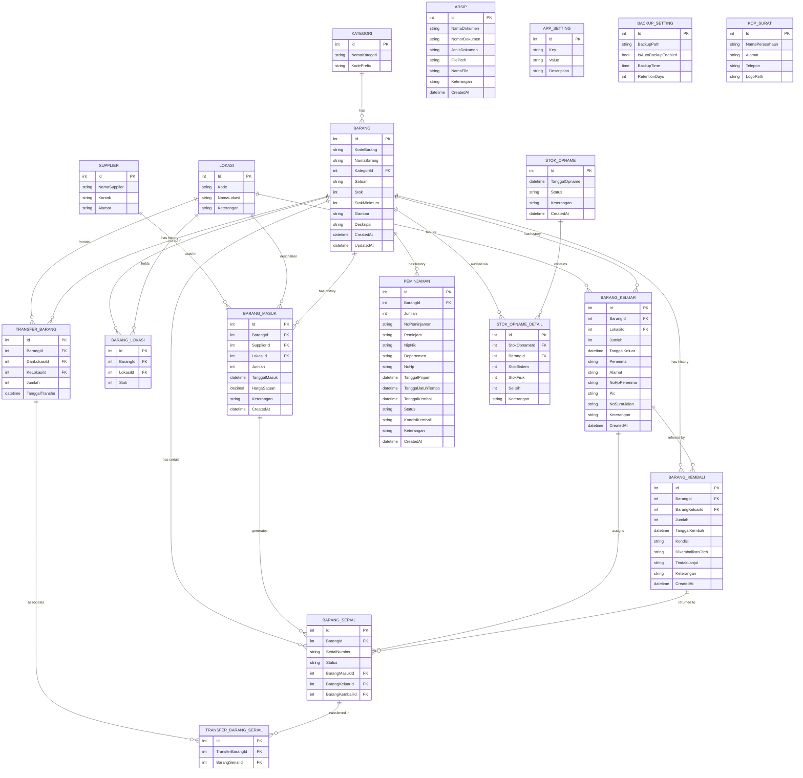

# 📦 MyGudang

**MyGudang** adalah Sistem Informasi Manajemen Inventaris & Gudang berbasis web yang dirancang khusus untuk mencatat, melacak, dan mengelola seluruh aktivitas pergudangan secara digital dan terpusat. Aplikasi ini dikembangkan untuk memastikan akurasi data stok barang, meminimalisir kehilangan, serta mempermudah pembuatan laporan dan dokumen resmi.

Aplikasi ini dikembangkan oleh **IT Region Jatimbalinus - PT Pertamina Patra Niaga**.

---

## 🌟 Fitur Utama (Features)

1. **Dashboard Informatif**
   Menampilkan ringkasan statistik (total barang, stok rendah/habis, mutasi bulan ini) beserta grafik interaktif pergerakan barang masuk/keluar yang dapat dikonfigurasi tampilannya.

2. **Manajemen Master Data Lengkap**
   - **Kategori & Supplier**: Mengelompokkan jenis barang dan mencatat daftar pemasok (vendor) beserta kontak dan alamat.
   - **Lokasi / Ruangan**: Mengelola letak fisik/ruangan tempat barang disimpan beserta kode lokasi unik.
   - **Data Barang**: Pencatatan spesifikasi lengkap (kode, nama, satuan, gambar, deskripsi) dan penentuan batas *Stok Minimum* untuk peringatan _restock_.

3. **Pencatatan Serial Number (S/N)**
   Mendukung pelacakan barang bergaransi tinggi/aset IT menggunakan fitur *Serial Number* yang melekat pada setiap transaksi masuk, keluar, kembali, maupun transfer barang.

4. **Siklus Inventaris Terintegrasi**
   - **Barang Masuk**: Penambahan stok dari Supplier beserta Harga Satuan (Mencetak Surat Jalan & BAST). Mendukung pencatatan S/N per item masuk.
   - **Barang Keluar**: Distribusi barang kepada Penerima tertentu lengkap dengan data PIC, No. HP Penerima, dan Alamat (Mencetak Surat Jalan & BAST — termasuk mode *Bulk Print* per Nomor Surat Jalan). Mendukung pencatatan S/N per item keluar.
   - **Peminjaman & Pengembalian**: Melacak pergerakan inventaris non-habis pakai yang sifatnya dipinjam, lengkap dengan NIP/NIK, Departemen, No. HP peminjam, serta notifikasi tanggal jatuh tempo. Status otomatis: Dipinjam / Dikembalikan / Terlambat.
   - **Barang Kembali**: Mencatat pengembalian barang dari transaksi Barang Keluar sebelumnya. Dilengkapi fitur **Tindak Lanjut** (Dikembalikan ke Stok / Dibuang/Rusak) untuk menangani barang yang kondisinya tidak layak pakai.
   - **Transfer Ruangan**: Memindahkan stok dari satu lokasi/ruangan ke ruangan lain tanpa mengubah total keseluruhan stok, mendukung transfer S/N.

5. **Stok Opname (Audit Fisik)**
   Modul pencatatan pencocokan stok fisik di lapangan dengan stok yang ada di sistem. Mendukung status Draft dan Final, beserta catatan selisih (penyesuaian stok) per item.

6. **Laporan & Export Excel Terotomatisasi**
   Fasilitas export seluruh transaksi (Barang Masuk, Keluar, Stok, Peminjaman, Transfer Barang, Stok Opname) ke format Excel dengan sekali klik, dengan layout menyesuaikan master data terkini.

7. **Fitur Pendukung Ekstra**
   - **Auto-Backup Database**: Pencadangan database terjadwal secara otomatis di latar belakang (_Background Service_), dengan konfigurasi path, waktu, dan retensi (hari).
   - **Setting Dokumen (Kop Surat)**: Personalisasi Kop Surat (Nama Perusahaan, Logo, Alamat) langsung dari UI untuk digunakan pada seluruh dokumen cetak.
   - **Penomoran Otomatis**: Konter otomatis untuk Nomor Surat Jalan, BAST, dan Peminjaman, dengan opsi reset manual.
   - **Log Aktivitas**: Merekam jejak audit lengkap — siapa melakukan apa dan kapan di seluruh modul.
   - **Arsip Dokumen**: Penyimpanan dan pengelolaan soft-file (PDF/dokumen) eksternal, lengkap dengan Nomor dan Jenis Dokumen.
   - **Manajemen User**: Pengelolaan akun pengguna termasuk pembuatan akun Admin baru oleh SuperAdmin.

---

## 🔄 Alur Kerja Aplikasi (Workflow)

Aplikasi memiliki alur pergudangan (*supply-chain*) standar yang mudah diikuti:

1. **Setup Awal**
   SuperAdmin memasukkan Master Lokasi, Kategori, Supplier, dan Kop Surat terlebih dahulu.
2. **Katalogisasi Barang**
   Menambahkan Data Barang baru, menentukan _Stok Minimum_, dan mendaftarkan kode awal.
3. **Penerimaan (Inbound)**
   User masuk ke modul Barang Masuk → Memilih Barang + Ruangan penyimpan → Memilih Supplier → Menentukan Jumlah, Harga Satuan & Serial Number (opsional). Otomatis menambah stok.
4. **Distribusi / Mutasi (Outbound / Move)**
   - *Keluar Tetap*: Modul Barang Keluar (Stok berkurang permanen, bisa cetak Surat Jalan & BAST bulk).
   - *Keluar Sementara*: Modul Peminjaman (Stok masih tercatat harus kembali, ada notifikasi jatuh tempo).
   - *Perpindahan Fisik*: Modul Transfer Barang dari Ruang A ke Ruang B.
5. **Pengembalian Barang**
   - Dari peminjaman: Melalui fitur *Kembalikan* di modul Peminjaman.
   - Dari barang keluar: Melalui modul Barang Kembali, dengan pilihan Tindak Lanjut (kembali ke stok / dibuang).
6. **Validasi (Audit)**
   Supervisor melakukan Stok Opname secara berkala untuk menyesuaikan stok fisik vs. sistem, kemudian finalisasi laporan.

---

## 🛠️ Teknologi yang Digunakan (Tech Stack)

| Kategori | Teknologi / Library | Kegunaan |
|----------|---------------------|----------|
| **Backend Framework** | ASP.NET Core MVC (v8.0) | Arsitektur utama, logika server, & kontroler. |
| **ORM & Database** | Entity Framework Core (v8.0) + MS SQL Server | Manajemen data Code-First Migration. |
| **Autentikasi** | ASP.NET Core Identity | Sistem *Role-Based Access Control* (SuperAdmin & Admin). |
| **Frontend UI** | AdminLTE v3.2 + Bootstrap 4 | Kerangka Dashboard antarmuka, responsif & bersih. |
| **Tabel Interaktif** | DataTables.js (v1.13) | Tabel dengan fitur Search, Pagination, Sort, dan Bulk Action. |
| **UI Components** | Select2, SweetAlert2 | Dropdown yang bisa dicari & notifikasi pop-up modern. |
| **Reporting / Export** | ClosedXML & EPPlus | Generate file Excel laporan kustom secara *on-the-fly*. |
| **Background Service** | .NET Hosted Service | Eksekusi auto-backup database terjadwal. |

---

## 📊 Entity Relationship Diagram (ERD)

Diagram di bawah ini menunjukkan struktur relasi database dari MyGudang:

---

## 🔒 Hak Akses Role (Access Level)

Aplikasi memiliki dua level peran user (Role) untuk manajemen akses:

| Fitur | SuperAdmin | Admin |
|-------|:----------:|:-----:|
| Dashboard & Statistik | ✅ | ✅ |
| Barang Masuk / Keluar / Kembali | ✅ | ✅ |
| Peminjaman & Transfer Barang | ✅ | ✅ |
| Stok Opname | ✅ | ✅ |
| Laporan & Export Excel | ✅ | ✅ |
| Master Data (Barang, Kategori, Lokasi, Supplier) | ✅ | ✅ |
| Arsip Dokumen | ✅ | ✅ |
| **Manajemen User** | ✅ | ❌ |
| **Log Aktivitas** | ✅ | ❌ |
| **Hapus Data Sensitif** | ✅ | ❌ |
| **Setelan Sistem (Kop Surat, Backup, App Setting)** | ✅ | ❌ |

---

> _Dokumentasi ini dibuat & dikelola agar pengembang maupun pengguna dapat memahami gambaran utuh dari aplikasi MyGudang._
