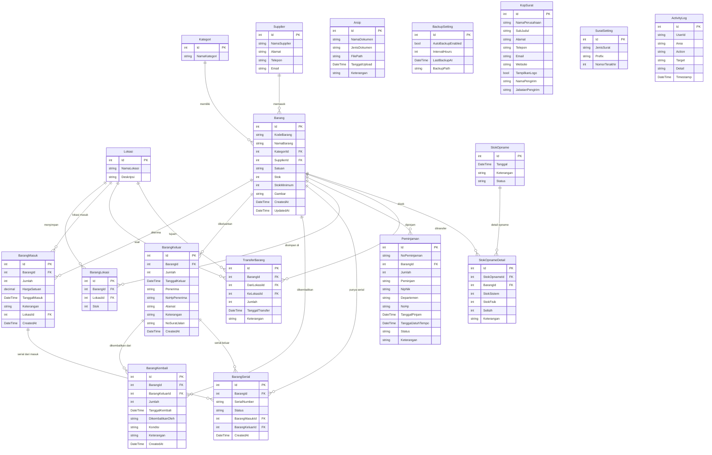

# 📦 IT Asset Management — Sistem Manajemen Gudang

Aplikasi manajemen gudang berbasis web yang dibangun menggunakan **ASP.NET Core 8 MVC** dengan **SQL Server Express**. Digunakan untuk mengelola stok barang, transaksi masuk/keluar, peminjaman, pengembalian, transfer antar lokasi, stok opname, arsip dokumen, dan pencetakan surat.

---

## ✨ Fitur Utama

| Modul | Deskripsi |
|-------|-----------|
| 📊 **Dashboard** | Ringkasan stok, grafik tren barang masuk/keluar, statistik real-time |
| 📋 **Data Barang** | CRUD barang + detail histori + **notifikasi stok minimum** |
| 📥 **Barang Masuk** | Catat penerimaan barang + histori harga satuan, import via Excel, cetak surat |
| 📤 **Barang Keluar** | Catat pengeluaran barang + cetak BAST & Surat Jalan |
| 🔄 **Pengembalian Barang** | Pengembalian barang keluar + cetak Surat Pengembalian |
| 🤝 **Peminjaman** | Peminjaman barang + cetak Surat Peminjaman + **Reminder Jatuh Tempo** |
| 🔀 **Transfer Barang** | Pindah barang antar lokasi/ruangan |
| 📑 **Stok Opname** | Pengecekan stok fisik vs sistem |
| 📂 **Arsip Dokumen** | Penyimpanan tiket, surat, dan manajemen dokumen digital dengan _Select2 tags_ |
| 🏢 **Lokasi / Ruangan** | Manajemen lokasi penyimpanan + stok per lokasi |
| 🏷️ **Kategori** | Pengelompokan barang |
| 🚚 **Supplier** | Data pemasok barang |
| 💾 **Backup & Restore** | Backup/restore database SQL Server, auto-backup terjadwal |
| 👤 **Manajemen User** | Role-based (SuperAdmin & Admin) |
| ⚙️ **Pengaturan** | Kop surat, setting nomor otomatis, setting visualisasi chart/grafik |
| 📝 **Log Aktivitas** | Audit trail sistem pencatatan riwayat aksi user (SuperAdmin) |

---

## 🛠️ Teknologi

- **Backend**: ASP.NET Core 8 MVC
- **Database**: SQL Server Express (via Entity Framework Core)
- **Frontend**: AdminLTE 3, Bootstrap 4, jQuery, DataTables, Select2, SweetAlert2
- **Auth**: ASP.NET Core Identity (Role-based)
- **Excel**: EPPlus 8 & ClosedXML
- **PDF/Print**: CSS Print Styling

---

## 📁 Struktur Proyek

```
MyGudang/
├── Controllers/                  # 20 Controllers
│   ├── AccountController.cs      # Login, Logout, Profil
│   ├── DashboardController.cs    # Halaman utama + statistik
│   ├── BarangController.cs       # CRUD Barang + Detail Histori
│   ├── BarangMasukController.cs  # Barang Masuk + Import Excel
│   ├── BarangKeluarController.cs # Barang Keluar + Surat Jalan + BAST
│   ├── BarangKembaliController.cs# Pengembalian Barang
│   ├── PeminjamanController.cs   # Peminjaman + Surat Peminjaman
│   ├── TransferBarangController.cs# Transfer antar lokasi
│   ├── StokController.cs         # Monitoring stok
│   ├── StokOpnameController.cs   # Stok opname
│   ├── KategoriController.cs     # CRUD Kategori
│   ├── SupplierController.cs     # CRUD Supplier
│   ├── LokasiController.cs       # CRUD Lokasi + Stok per lokasi
│   ├── LaporanController.cs      # Laporan Rekap, Export PDF/Excel
│   ├── ArsipController.cs        # Manajemen arsip dokumen
│   ├── BackupController.cs       # Backup & Restore DB (SuperAdmin)
│   ├── ActivityLogController.cs  # Log Aktivitas (SuperAdmin)
│   ├── UserController.cs         # Manajemen user (SuperAdmin)
│   ├── KopSuratController.cs     # Setting kop surat
│   ├── SuratSettingController.cs # Nomor surat otomatis
│   ├── ChartSettingController.cs # Setting chart dashboard
│   └── HomeController.cs         # Landing page
│
├── Models/                       # 18 Entity Models
│   ├── Barang.cs                 # Master barang
│   ├── BarangMasuk.cs            # Transaksi masuk
│   ├── BarangKeluar.cs           # Transaksi keluar
│   ├── BarangKembali.cs          # Pengembalian
│   ├── BarangSerial.cs           # Serial number per unit
│   ├── BarangLokasi.cs           # Stok per lokasi
│   ├── Peminjaman.cs             # Peminjaman barang
│   ├── TransferBarang.cs         # Transfer antar lokasi
│   ├── StokOpname.cs             # Header stok opname
│   ├── Kategori.cs               # Kategori barang
│   ├── Supplier.cs               # Supplier barang
│   ├── Lokasi.cs                 # Lokasi/ruangan
│   ├── Arsip.cs                  # Arsip dokumen
│   ├── BackupSetting.cs          # Konfigurasi auto-backup
│   ├── ActivityLog.cs            # Tabel Audit Log
│   ├── KopSurat.cs               # Data kop surat
│   ├── SuratSetting.cs           # Format nomor surat
│   └── ChartSetting.cs           # Konfigurasi chart
│
├── Views/                        # 21 View Folders
│   ├── Shared/                   # Layout, Partial views
│   ├── Dashboard/                # Halaman dashboard
│   ├── Barang/                   # Index, Create, Edit, Detail
│   ├── BarangMasuk/              # Index (+ Import Excel)
│   ├── BarangKeluar/             # Index, SuratJalan, BAST, Edit
│   ├── BarangKembali/            # Index, SuratPengembalian
│   ├── Peminjaman/               # Index, Create, SuratPeminjaman
│   ├── TransferBarang/           # Index, Create
│   ├── Stok/                     # Monitor stok
│   ├── StokOpname/               # Index, Create
│   ├── Backup/                   # Halaman backup & restore
│   └── ...                       # Kategori, Supplier, Lokasi, dll
│
├── Services/
│   └── BackupService.cs          # Background service auto-backup
│
├── Data/
│   └── ApplicationDbContext.cs   # EF Core DbContext + Fluent API
│
├── wwwroot/
│   ├── css/site.css              # Custom styles + Print styles
│   ├── js/site.js                # Custom JavaScript
│   ├── images/                   # Logo dan gambar
│   └── backups/                  # File backup database (.bak)
│
├── Program.cs                    # App configuration & middleware
├── appsettings.json              # Connection string & EPPlus license
└── MyGudang.csproj               # Project dependencies
```

---

## 🗃️ Entity Relationship Diagram



---

## 🔐 Hak Akses (Role)

| Fitur | SuperAdmin | Admin |
|-------|:----------:|:-----:|
| Dashboard | ✅ | ✅ |
| Data Barang | ✅ | ✅ |
| Barang Masuk/Keluar | ✅ | ✅ |
| Peminjaman | ✅ | ✅ |
| Transfer Barang | ✅ | ✅ |
| Stok & Stok Opname | ✅ | ✅ |
| Arsip Dokumen | ✅ | ✅ |
| Kategori & Supplier | ✅ | ✅ |
| Laporan Rekap | ✅ | ✅ |
| Manajemen User | ✅ | ❌ |
| Log Aktivitas (Audit) | ✅ | ❌ |
| Setting Kop Surat | ✅ | ❌ |
| Setting Nomor Surat | ✅ | ❌ |
| Setting Chart | ✅ | ❌ |
| Backup & Restore | ✅ | ❌ |
| Lokasi / Ruangan | ✅ | ❌ |

---

## 🚀 Cara Menjalankan

### Prasyarat
- [.NET 8 SDK](https://dotnet.microsoft.com/download/dotnet/8.0)
- [SQL Server Express](https://www.microsoft.com/en-us/sql-server/sql-server-downloads)

### Langkah
```bash
# 1. Clone repository
git clone https://github.com/danzone4u/MyGudang.git
cd MyGudang

# 2. Sesuaikan connection string di appsettings.json
# (Server, Database, User Id, Password)

# 3. Jalankan migrasi database
dotnet ef database update

# 4. Jalankan aplikasi
dotnet run
```

Aplikasi akan berjalan di `http://localhost:5156`

### Akun Default
| Email | Password | Role |
|-------|----------|------|
| admin@mygudang.com | Admin@123 | SuperAdmin |

---

## 📄 Daftar Surat yang Dapat Dicetak

| Surat | Modul | Format |
|-------|-------|--------|
| Surat Jalan | Barang Keluar | Print / PDF |
| Berita Acara Serah Terima Barang (BAST) | Barang Keluar | Print / PDF |
| Surat Peminjaman Barang | Peminjaman | Print / PDF |
| Surat Pengembalian Barang | Pengembalian | Print / PDF |

---

## 📸 Teknologi & Library

| Library | Versi | Kegunaan |
|---------|-------|----------|
| ASP.NET Core | 8.0 | Web Framework |
| Entity Framework Core | 8.0 | ORM |
| ASP.NET Core Identity | 8.0 | Autentikasi & Otorisasi |
| AdminLTE | 3.2 | UI Template |
| DataTables | 1.13 | Tabel interaktif + sorting |
| Select2 | 4.1 | Searchable dropdown |
| SweetAlert2 | 11.x | Dialog & notifikasi |
| EPPlus | 8.x | Import/Export Excel |
| ClosedXML | 0.102 | Export Excel alternatif |

---

*Dikembangkan oleh IT Region Jatimbalinus — PT Pertamina Patra Niaga*
