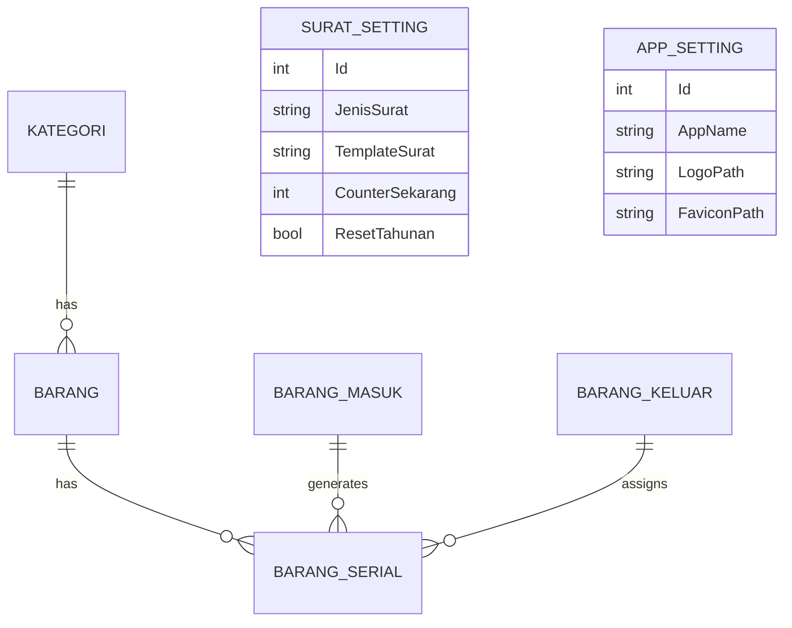

# 📦 ITAM (IT Asset Management) - MyGudang

**ITAM (MyGudang)** adalah Sistem Informasi Manajemen Inventaris & Aset TI berbasis web yang dirancang khusus untuk mencatat, melacak, dan mengelola seluruh aktivitas pergudangan secara digital dan terpusat. Aplikasi ini dikembangkan untuk memastikan akurasi data stok barang, meminimalisir kehilangan, serta mempermudah pembuatan laporan dan dokumen resmi dengan standar profesional.

Aplikasi ini dikembangkan oleh **IT Region Jatimbalinus - PT Pertamina Patra Niaga**.

---

## 🌟 Fitur Unggulan (Core Features)

1.  **Dashboard & Statistik Real-time**
    Visualisasi data stok, mutasi bulanan, dan peringatan stok minimum dalam grafik interaktif yang dapat dikustomisasi.

2.  **Sistem Penomoran Dokumen Dinamis (Template-Based)**
    Fleksibilitas penuh dalam menentukan format Nomor Surat Jalan dan BAST menggunakan tag otomatis seperti `{PREFIX}`, `{NOMOR}`, `{TAHUN}`, `{BULAN_ROMAWI}`, dll. Mendukung reset counter secara **Bulanan** maupun **Tahunan**.

3.  **Import Data Cerdas (Smart Import)**
    Fasilitas import data via Excel yang andal. Sistem secara otomatis mendeteksi dan melewati (*skip*) Serial Number yang sudah ada (duplikat) tanpa menggagalkan seluruh proses import, lengkap dengan laporan warning detail.

4.  **Manajemen Master Data & Lokasi**
    Pengelolaan kategori, supplier, dan ruangan penyimpanan yang terintegrasi. Dilengkapi dengan proteksi penghapusan data (data safety) jika masih memiliki keterkaitan dengan inventaris aktif.

5.  **Pelacakan Serial Number (S/N)**
    Manajemen aset presisi tinggi dengan pelacakan nomor seri unik pada setiap tahap: Barang Masuk, Keluar, Kembali, hingga Transfer antar ruangan.

6.  **Siklus Inventaris Lengkap**
    *   **Barang Masuk & Keluar**: Cetak Surat Jalan & BAST secara instan.
    *   **Peminjaman**: Reservasi aset sementara dengan notifikasi jatuh tempo.
    *   **Transfer Ruangan**: Mutasi internal antar lokasi tanpa mengubah total stok global.
    *   **Barang Kembali**: Penanganan barang retur dengan opsi tindak lanjut (Restock atau Disposal).

7.  **Audit & Keamanan**
    *   **Stok Opname**: Modul audit fisik untuk sinkronisasi stok sistem vs lapangan.
    *   **Log Aktivitas**: Rekam jejak audit (audit trail) untuk setiap tindakan user.
    *   **Auto-Backup**: Pencadangan database otomatis terjadwal ke directory lokal.

---

## 🛠️ Teknologi yang Digunakan (Tech Stack)

| Kategori | Teknologi / Library |
|----------|---------------------|
| **Backend** | ASP.NET Core MVC 8.0 (LTS) |
| **Database** | MS SQL Server + EF Core (Code First) |
| **Authentication** | ASP.NET Core Identity (Identity Framework) |
| **UI Framework** | AdminLTE v3.2 + Bootstrap 4 |
| **Interactivity** | DataTables.js, Select2, SweetAlert2 |
| **Report Engine**| ClosedXML & EPPlus (Excel Generation) |
| **Deployment** | IIS 10+ Support (Sub-folder ready) |

---

## 🚀 Panduan Deployment (IIS)

Aplikasi ini telah dioptimalkan untuk berjalan sebagai **Sub-Application** di IIS (misal: `domain.com/itam/`).

### 1. Konfigurasi `appsettings.json`
Pastikan Anda menambahkan kunci `PathBase` agar routing dan cookie berjalan dengan benar:
```json
{
  "PathBase": "/itam",
  "ConnectionStrings": {
    "DefaultConnection": "Server=localhost;Database=itamDB;User Id=...;Password=..."
  }
}
```

### 2. Folder Izin (Permissions)
Berikan izin **Write / Full Control** kepada user IIS (App Pool) untuk folder berikut:
*   `wwwroot/uploads`: Tempat penyimpanan gambar logo, favicon, dan foto barang.
*   `DataProtectionKeys`: Folder penyimpanan kunci enkripsi sesi login.

### 3. Database Migration
Aplikasi akan otomatis menjalankan migrasi saat pertama kali dijalankan. Pastikan akun SQL Server memiliki izin untuk memodifikasi schema (`db_owner`).

---

## 📊 Struktur Data (ERD Preview)



---

## 🔒 Tingkat Akses (Role Management)

*   **SuperAdmin**: Akses penuh ke seluruh modul, manajemen user, log aktivitas, dan pengaturan sistem (Backup/Kop Surat).
*   **Admin**: Akses operasional harian (Barang Masuk/Keluar, Stok, Laporan), namun tidak dapat mengelola user atau menghapus log sistem.

---
> _Developed with ❤️ by IT Region Jatimbalinus - PT Pertamina Patra Niaga_
