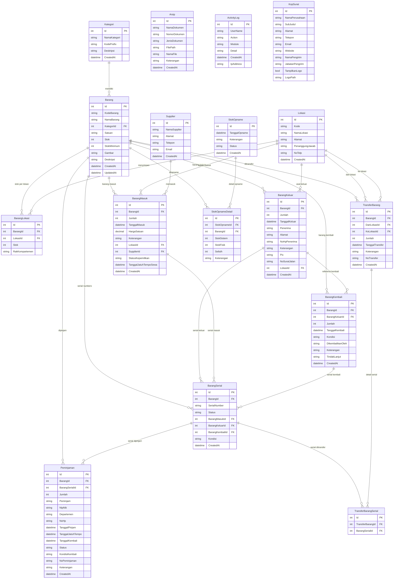

# Entity Relationship Diagram — ITAM

Diagram berikut menggambarkan seluruh entitas dan relasi dalam sistem **IT Asset Management (ITAM)** berdasarkan model C# yang ada di folder `Models/`.

---

## Ringkasan Relasi Utama

| Relasi | Tipe | Keterangan |
|--------|------|------------|
| **Kategori → Barang** | 1 : N | Satu kategori memiliki banyak barang |
| **Barang → BarangMasuk** | 1 : N | Barang bisa masuk berkali-kali |
| **Barang → BarangKeluar** | 1 : N | Barang bisa keluar berkali-kali |
| **Barang → BarangKembali** | 1 : N | Barang bisa dikembalikan berkali-kali |
| **Barang → BarangSerial** | 1 : N | Barang bisa punya banyak serial number |
| **Barang ↔ Lokasi** (via BarangLokasi) | N : M | Stok per barang per lokasi (junction table) |
| **Supplier → BarangMasuk** | 1 : N | Satu supplier bisa memasok banyak transaksi masuk |
| **Lokasi → BarangMasuk / BarangKeluar** | 1 : N | Lokasi tujuan/asal transaksi |
| **BarangKeluar → BarangKembali** | 1 : N | Pengembalian mereferensi barang keluar |
| **BarangSerial → BarangMasuk / BarangKeluar / BarangKembali** | N : 1 | Serial terkait ke transaksi masuk, keluar, atau kembali |
| **Barang → Peminjaman** | 1 : N | Barang bisa dipinjam berkali-kali |
| **BarangSerial → Peminjaman** | 1 : N | Peminjaman bisa merujuk serial tertentu |
| **TransferBarang → Lokasi** (2 FK) | N : 1 | Transfer dari satu lokasi ke lokasi lain |
| **TransferBarang ↔ BarangSerial** (via TransferBarangSerial) | N : M | Serial yang ikut ditransfer |
| **StokOpname → StokOpnameDetail → Barang** | 1 : N : 1 | Detail opname per barang |

> **Arsip**, **ActivityLog**, dan **KopSurat** adalah entitas standalone tanpa relasi ke entitas lain.
